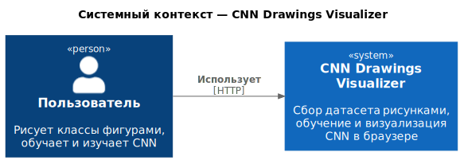
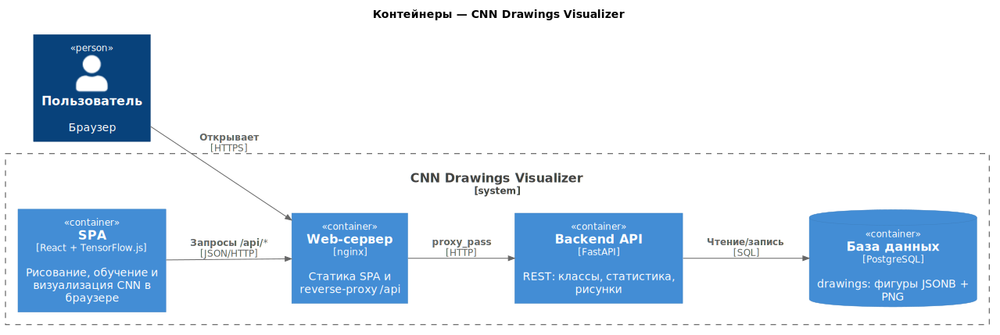
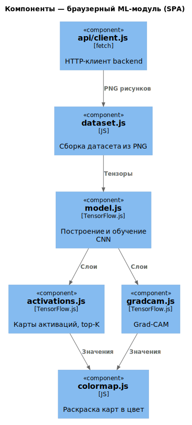

# CNN Visualizer

Веб-приложение для интерактивного изучения свёрточных нейросетей. Пользователь
сам формирует обучающие классы, рисуя их простыми геометрическими фигурами;
рисунки всех пользователей складываются в общий датасет в PostgreSQL. Затем
прямо в браузере на TensorFlow.js собирается и обучается CNN, а её внутренняя
работа показывается через визуализации (карты активаций, top-K каналов,
Grad-CAM).

## Возможности

- Выбор любых 2 классов из пула и сбор датасета через рисование фигурами
  (прямоугольник, круг, эллипс, треугольник, линия — drag / resize / rotate).
- Мобильная модерация новых рисунков через `/moderate`: вход по секретному
  ключу и принятие/отклонение свайпом вправо/влево.
- Конфигурируемая архитектура CNN (добавление/удаление conv- и pool-слоёв) и
  обучение в браузере без сервера для вычислений.
- Визуализации обученной модели:
  - **Карты активаций** по всем conv/pool-слоям (средняя и максимальная);
  - **Top-K каналов** предпоследнего conv-слоя (mid-level признаки);
  - **Grad-CAM** на последнем conv-слое — области, на которые «смотрит» сеть.

## Технологический стек

| Слой        | Технологии                                                        |
|-------------|-------------------------------------------------------------------|
| Frontend    | React, TensorFlow.js, Vite, Tailwind                              |
| Backend     | FastAPI, SQLAlchemy, Alembic, Pydantic, Uvicorn                   |
| База данных | PostgreSQL                                                        |
| Инфраструктура | Docker, nginx                                                  |

## Архитектура

Диаграммы построены в нотации [C4](https://c4model.com/) с помощью
[C4-PlantUML](https://github.com/plantuml-stdlib/C4-PlantUML); исходники —
в [`docs/architecture/`](docs/architecture).

### Уровень 1 — Контекст



### Уровень 2 — Контейнеры



### Уровень 3 — Компоненты браузерного ML-модуля



## Модель CNN

- **Вход:** 64×64×1 grayscale.
- **Тело:** последовательность conv-слоёв (`padding=same`, ReLU) и
  max/avg-pooling 2×2 по конфигурации пользователя. Дефолтная архитектура —
  4 conv + 2 pool (`model.js → DEFAULT_LAYERS`).
- **Голова:** Global Average Pooling → Dense(2, softmax).
- **Обучение:** оптимизатор Adam, функция потерь `categoricalCrossentropy`,
  гиперпараметры (эпохи, learning rate, batch size) задаются в UI.

Карты активаций строятся моделью по всем conv/pool-слоям; top-K
берёт каналы с наибольшей средней активацией `предпоследнего` conv-слоя; Grad-CAM
вешается на `последний` conv-слой.

## Модель db

Одна таблица `drawings`:

| Поле         | Тип            | Описание                                  |
|--------------|----------------|-------------------------------------------|
| `id`         | integer PK     | автоинкремент                             |
| `label`      | varchar(50)    | класс из пула (индекс `idx_drawings_label`) |
| `nickname`   | varchar(50)    | автор рисунка                             |
| `shapes`     | JSONB          | исходные фигуры (для воспроизведения)      |
| `png`        | bytea          | растеризованный PNG                        |
| `moderation_status` | varchar(20) | `pending`, `approved` или `rejected` |
| `reviewed_by` | varchar(50)   | кто выполнил модерацию                     |
| `reviewed_at` | timestamptz   | время модерации                            |
| `created_at` | timestamptz    | `now()` по умолчанию                       |

## REST API

| Метод | Путь                            | Описание                                  |
|-------|---------------------------------|-------------------------------------------|
| GET   | `/api/health`                   | health-check                              |
| GET   | `/api/labels`                   | пул доступных классов                     |
| GET   | `/api/drawings/stats`           | счётчики рисунков по классам              |
| GET   | `/api/drawings?label=X&limit=N` | одобренные рисунки класса (PNG в base64)  |
| POST  | `/api/drawings`                 | сохранить рисунок на модерацию            |
| GET   | `/api/drawings/moderation`      | новые рисунки, требует `X-Secret-Key`     |
| GET   | `/api/drawings/moderation/stats` | счётчик новых рисунков, требует `X-Secret-Key` |
| PATCH | `/api/drawings/{id}/moderation` | принять/отклонить рисунок, требует `X-Secret-Key` |

Тело `POST /api/drawings`:

```json
{
  "label": "apple",
  "nickname": "Маша",
  "shapes": [{"type": "circle", "x": 128, "y": 128, "radius": 50, "fill": "#fff"}],
  "png_base64": "iVBORw0KGgo..."
}
```

Интерактивная документация API (Swagger UI) — `http://localhost:8000/docs`.

## Docker (Запуск проекта)

```bash
cp .env.template .env
docker compose up --build
```

После сборки:

- Frontend → <http://localhost:5173>
- Backend / OpenAPI → <http://localhost:8000/docs>
- PostgreSQL → `localhost:${POSTGRES_PORT}` (по умолчанию `postgres` / `postgres`)
- Модерация → <http://localhost:5173/moderate> (`MODERATION_SECRET_KEY` из `.env`)

Миграции применяются автоматически при старте backend-контейнера
(`alembic upgrade head`).

## Наполнение датасета

Скрипт генерирует синтетические рисунки тем же набором фигур, что и фронтенд, и
отправляет их в API:

```bash
pip install requests pillow
python scripts/seed_drawings.py --count 50           # 50 рисунков на каждый класс
python scripts/seed_drawings.py --labels apple star  # только указанные классы
```

## Структура проекта

```
course-work/
├── backend/                    FastAPI + SQLAlchemy + Alembic
│   ├── app/
│   │   ├── main.py             точка входа, CORS, роутеры
│   │   ├── config.py           пул классов (LABELS) и настройки
│   │   ├── database.py         engine / session
│   │   ├── models.py           ORM-модель Drawing
│   │   ├── schemas.py          Pydantic-схемы
│   │   └── routes/drawings.py  REST-эндпоинты
│   ├── alembic/                миграции
│   ├── requirements.txt
│   └── Dockerfile
├── web/                        React + TensorFlow.js
│   ├── src/
│   │   ├── pages/              Home, Draw, Train
│   │   ├── components/         ShapeCanvas, ModelConfig, ActivationMaps, …
│   │   ├── utils/              shapes, dataset, model, activations, gradcam, …
│   │   └── api/client.js
│   ├── nginx.conf
│   └── Dockerfile
├── scripts/seed_drawings.py    генератор синтетических рисунков
├── docker-compose.yml
├── .env.template
└── Cat_VS_Dog.ipynb            исходный notebook КТ1
```
